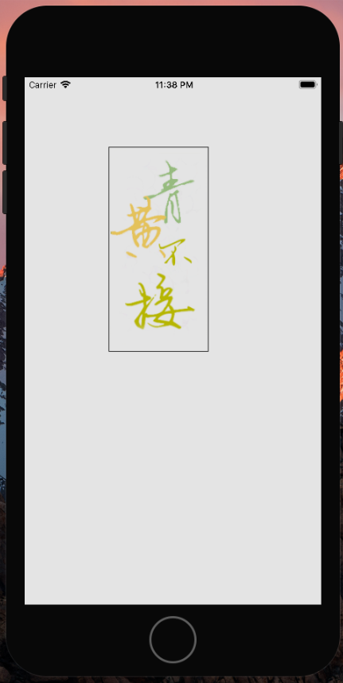
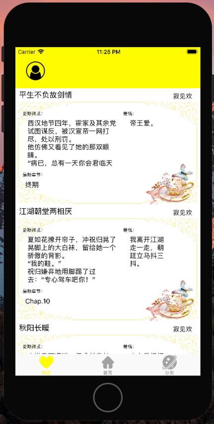
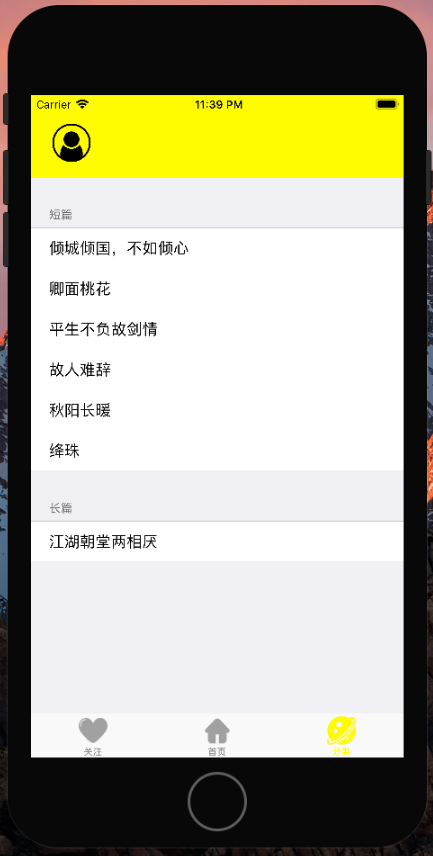
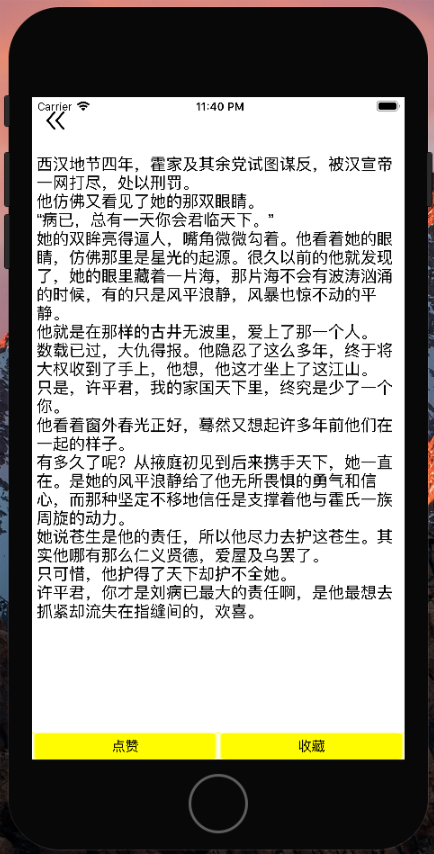
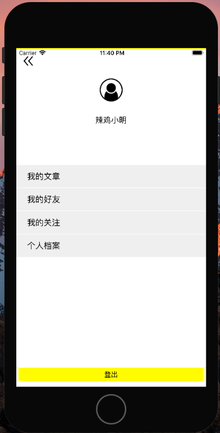
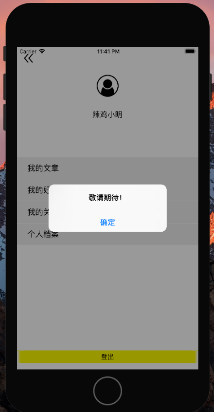
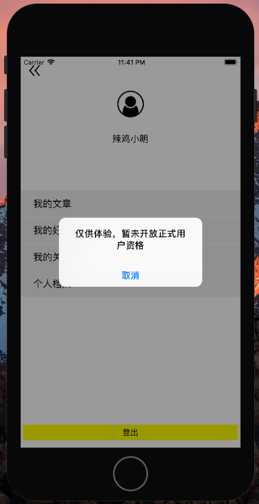
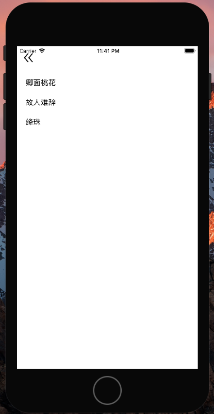
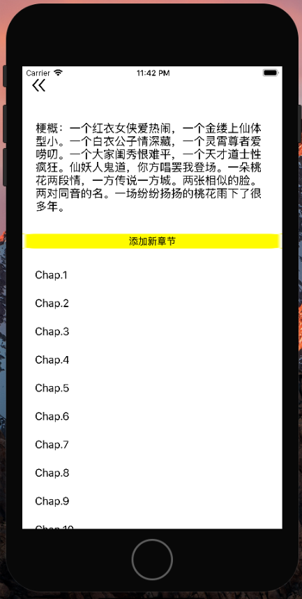
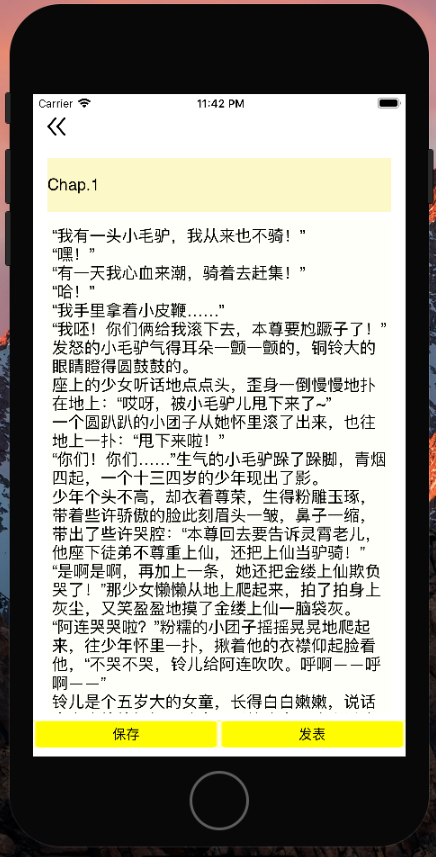

# QingHuangBuJie
app ios swift

## 该app需要连网！所以如果第一次运行很可能因为无线网络还没被授权失败，只要授权后再启动即可。

功能需求和描述： 
1.服务端决定首页推荐文章。 
2.用户能够获取服务器推荐的文章，能够获取自己收藏的文章。同时用户自己能够保存发表文章，自己保存的文章自己能看见，但是出现在首页或者被别人看见是要经过服务器管理人员审核。 
3.出现在首页和关注页面的文章展现的是最新更新的章节内容。 
4.app运行时用户默认是以“辣鸡小明”登录的，这个app侧重点不在用户管理上，所以并没有展示出用户登陆和下线的状态，但是所有展示内容是由用户偏好决定的。 

具体实现： 
1.所有数据由服务器提供，这里我以github的仓库搭了一个简易服务器 
2.在app预启动的时候，从服务器端爬下来需要展示在首页的数据以及用户数据，根据用户数据，再去爬取其他所需数据 
3.将这些数据保存在coredata中，将具体正文内容保存在文件中 
4.服务器端和app是以json文件交互的 
5.各ViewController根据coredata的数据填充页面、响应操作 

操作示例： 
1.启动app，出现logo界面，需要点击屏幕一下进入app： 
 
2.（已登录）主界面由“关注”、“首页”、“分类”三个页面构成，其中“关注”和“首页”的展示样式是一样的，数据来源不同： 
 
3.“分类”页面会列出所有的文章，按类排列好： 
 
4.这三个主界面的条目点进去，显示的都是这篇小说的最新更新内容，点击收藏的话，这部小说就会马上出现在你的关注页面： 
 
5.点击左上角的头像按钮进入个人页面： 
 
6.在这个个人用户界面，因为主要想实现的是“我的文章”部分，所以只实现了这个相关内容，其它三个条目是因为为了看起来更好看加上去的，点进去只会提示“敬请期待！”： 
 
7.因为之前说了这个并没有进行细致的用户管理，所以这个用户算是预登录的，点击“登出”按钮会提示： 
 
8.点进“我的文章”，显示自己所写的文章列表，注意这个“我的文章”中的文章是指自己创作的： 
 
9.点进某一条，会显示对应的小说信息，梗概和章节名，以及“添加新章节”的按钮： 
 
10.点击“添加新章节”和某一章节，都会进入编辑章节页面： 
 
11.点击“保存”后，退回上一页面信息会更新。 
